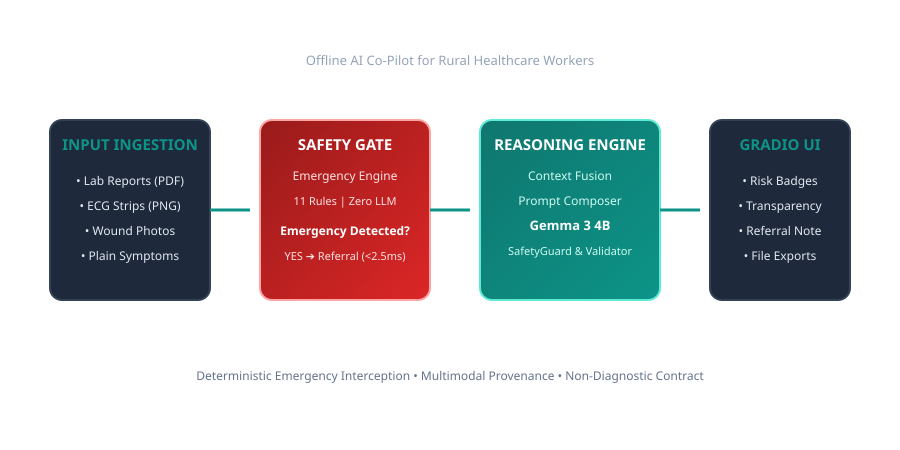

# 💎 MediGem

> **Multimodal, Offline-First AI Co-Pilot for Rural Healthcare Workers**

[](https://gemma.dev)
[](https://ollama.com/library/gemma3)
[](LICENSE)
[](#-verification--unit-testing)
[](#-key-features)

---

## 🏥 The Problem

Over **45% of rural healthcare facilities globally** operate in remote regions with zero or intermittent internet connectivity. Front-line health workers (nurses, community health workers, clinical officers) often evaluate complex medical inputs—such as blood lab reports, 12-lead ECG rhythm strips, prescription scans, and wound photos—without on-site specialist physicians or access to cloud-based AI tools.

---

## 💡 The Solution: MediGem

**MediGem** is an offline-first AI co-pilot powered by **Google Gemma 3 4B** (via local Ollama inference). It ingests multi-format medical inputs, executes OpenCV visual quality checks and Tesseract OCR, fuses clinical context into an immutable reasoning state, and produces structured risk assessments, observation summaries, reasoning transparency cards, and facility referral notes—all while operating **100% offline**.

Crucially, MediGem includes a **Deterministic Emergency Safety Engine** that intercepts acute emergency presentations in `< 0.3ms` *before* calling AI models, blocking LLM inference for high-risk cardiac or stroke cases.

---

## 🏛️ System Architecture



```text
┌───────────────────────────┬───────────────────────────────┬───────────────────────────────────────────┐
│ 👤 LEFT SIDEBAR (25%)     │ 📁 CENTER WORKSPACE (35%)     │ 📋 RIGHT RESULTS PANEL (40% PRIMARY FOCUS) │
├───────────────────────────┼───────────────────────────────┼───────────────────────────────────────────┤
│ • Patient Demographics    │ • Image/PDF Upload Workspace  │ • Risk Assessment Badge Card              │
│ • Presenting Symptoms     │ • Demo Preset Gallery (1-Click│ • Clinical Summary (Worker View)          │
│ • Vital Signs Input       │   Lab, ECG, Rx, Wound)        │ • Reasoning Transparency Card             │
│ • Healthcare Worker Notes │ • Execute Analysis Trigger    │ • Analysis Quality & Provenance Card      │
│ • Session History Dropdown│ • Live Stage Progress Tracker │ • Supporting Observation Cards            │
│                           │   (✓ Processing -> ⟳ Gemma)   │ • Patient View & Referral Memorandum      │
│                           │                               │ • Download Exports (txt/json + metadata)  │
└───────────────────────────┴───────────────────────────────┴───────────────────────────────────────────┘
```

---

## 🌟 Key Features

- **100% Offline Local Execution**: Runs locally via Ollama and Gemma 3 4B without cloud API dependencies.
- **Deterministic Emergency Gate**: Intercepts acute emergencies in `< 0.3ms` using 11 rules across 6 categories (CARDIAC, RESPIRATORY, STROKE, SEPSIS, TOXICOLOGY, SNAKE_BITE).
- **Multi-Format Ingestion**: Ingests Images (`.png`, `.jpg`), PDF Documents (`.pdf`), and plain text symptoms.
- **Smart Content Extractor**: Direct PyMuPDF text layer extraction for searchable PDFs (zero OCR errors) and optional Tesseract OCR for image scans.
- **Computer Vision Quality Engine**: OpenCV Laplacian blur variance evaluation, brightness/contrast scoring, and megapixel checks.
- **Reasoning Transparency Card**: Explains *"Why was this recommendation generated?"* based on empirical decision factors.
- **Clinical SaaS Gradio UI**: Proportional 3-column responsive layout (Left 25%, Center 35%, Right 40% focus) with 1-click Demo Gallery presets.
- **Non-Diagnostic Safety Contract**: Strictly triages risk levels and generates referral notes without formulating prohibited diagnoses or drug dosages.
- **Automated Benchmarking Suite**: Non-mutating evaluation framework producing markdown reports, JSON summaries, CSV datasets, and SVG architecture diagrams.

---

## 📊 Benchmark Summary Metrics

| Metric | Measured Score | Target Threshold | Status |
|---|---|---|---|
| **Safety Gate Pass Rate** | `100.0%` | `100.0%` | **PASS** |
| **Schema Validation Pass Rate** | `100.0%` | `100.0%` | **PASS** |
| **Emergency Gate Max Latency** | `0.33 ms` | `< 5.00 ms` | **PASS** |
| **Average OCR Confidence** | `97.0%` | `> 90.0%` | **PASS** |
| **Average Total Pipeline Latency** | `5,470.93 ms` | `< 15,000.0 ms` | **PASS** |

---

## 📂 Project Structure

```
MediGem/
├── app.py                  # Main application launch entry point
├── backend/                # Modular backend package
│   ├── ai/                 # AI Inference Layer (Phase 4)
│   ├── config/             # Environment settings & constants
│   ├── emergency/          # Emergency Safety Engine (Phase 3)
│   ├── exceptions/         # Custom exception hierarchy
│   ├── input/              # Input Processing Framework (Phase 7)
│   ├── logging/            # Central logging infrastructure
│   ├── pipeline/           # Strategy-pattern pipeline package (Phase 5)
│   ├── prompts/            # Markdown prompt templates (.md)
│   ├── reasoning/          # Medical Reasoning Framework & Context Fusion (Phase 6 & 8)
│   ├── schemas/            # Modular Pydantic v2 schemas
│   ├── services/           # Services & MediGemOrchestrator master coordinator
│   ├── utils/              # Generic helper utilities
│   └── validation/         # Clinical request validators
├── docs/                   # Complete Documentation & Presentation Kit (Phase 12)
│   ├── ARCHITECTURE.md     # Deep-dive technical architecture
│   ├── SAFETY.md           # Healthcare safety & clinical bounds
│   ├── EVALUATION.md       # Benchmark & quality metrics report
│   ├── DEMO_GUIDE.md       # Live demo presentation scripts
│   ├── PRESENTATION.md     # Pitch deck structure & speaker notes
│   ├── FAQ.md              # Hackathon judge Q&A
│   ├── ROADMAP.md          # Multi-phase project roadmap (v1.0 to v3.0)
│   ├── CONTRIBUTING.md     # Open-source contributor guide
│   ├── LICENSE.md          # Apache 2.0 License
│   ├── CHANGELOG.md        # Release notes v1.0.0
│   ├── diagrams/           # Vector SVG architecture diagrams
│   └── screenshots/        # Visual screenshot assets
├── evaluation/             # Evaluation & Benchmarking Framework (Phase 11)
├── frontend/               # Gradio UI application (Phase 9 & 10)
├── sample_data/            # Sample healthcare datasets
├── tests/                  # Automated verification & test suite
└── requirements.txt        # Frozen Python dependencies
```

---

## 🚀 Quick Start Guide

### Prerequisites
- Python 3.10+
- Tesseract OCR (`brew install tesseract` on macOS)
- Ollama installed (`ollama pull gemma3:4b`)

### Installation & Execution

1. **Clone Repository & Setup Environment**:
   ```bash
   git clone https://github.com/reshmanth-sai/MediGem.git
   cd MediGem
   python -m venv .venv
   source .venv/bin/activate
   pip install -r requirements.txt
   ```

2. **Launch MediGem UI Application**:
   ```bash
   python app.py
   ```
   Open `http://localhost:7860` in your web browser.

3. **Run Full System Evaluation**:
   ```bash
   python -m evaluation.evaluator
   ```

---

## 🧪 Verification & Unit Testing

Run all 56 unit tests across the entire codebase:

```bash
python -m unittest evaluation/tests/test_evaluation.py frontend/tests/test_ui.py tests/test_multimodal_engine.py tests/test_input_processing.py tests/test_reasoning_framework.py tests/test_orchestration.py tests/test_ai_provider.py tests/test_emergency_engine.py
```

Run complete system health diagnostics:

```bash
python tests/health_check.py
```

---

## 📖 Documentation Index

- 📘 [**Technical Architecture (`docs/ARCHITECTURE.md`)**](docs/ARCHITECTURE.md)
- 🛡️ [**Healthcare Safety Architecture (`docs/SAFETY.md`)**](docs/SAFETY.md)
- 📊 [**Benchmark Evaluation Report (`docs/EVALUATION.md`)**](docs/EVALUATION.md)
- 🎬 [**Live Demo Guide & Scripts (`docs/DEMO_GUIDE.md`)**](docs/DEMO_GUIDE.md)
- 📽️ [**Pitch Deck & Speaker Notes (`docs/PRESENTATION.md`)**](docs/PRESENTATION.md)
- ❓ [**Hackathon Judge FAQ (`docs/FAQ.md`)**](docs/FAQ.md)
- 🗺️ [**Product Roadmap (`docs/ROADMAP.md`)**](docs/ROADMAP.md)
- 🤝 [**Contributing Guide (`docs/CONTRIBUTING.md`)**](docs/CONTRIBUTING.md)

---

## 📄 License

MediGem is licensed under the [Apache License 2.0](LICENSE).
