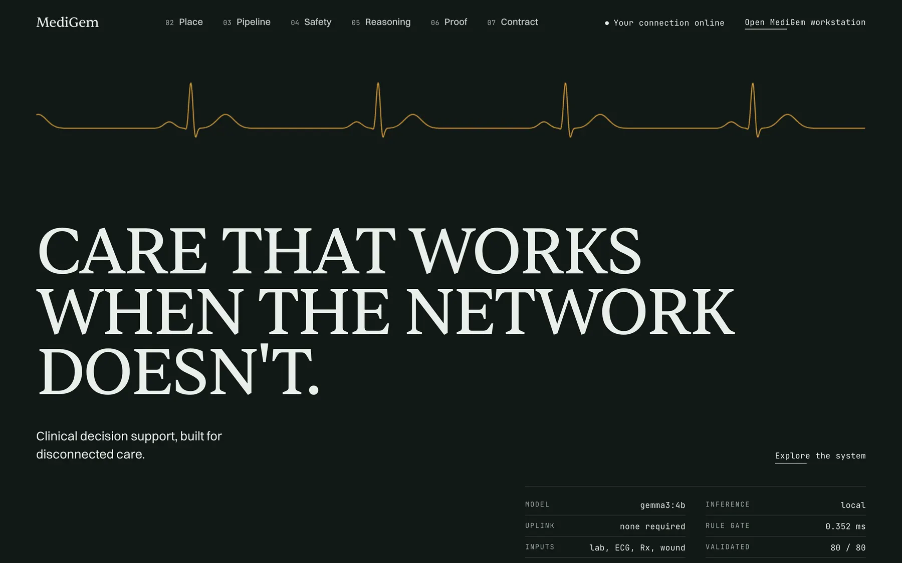
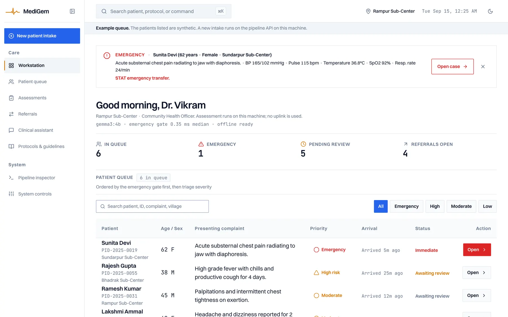
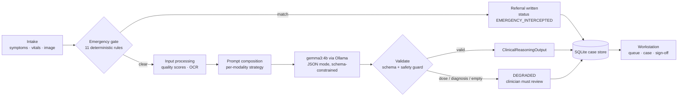
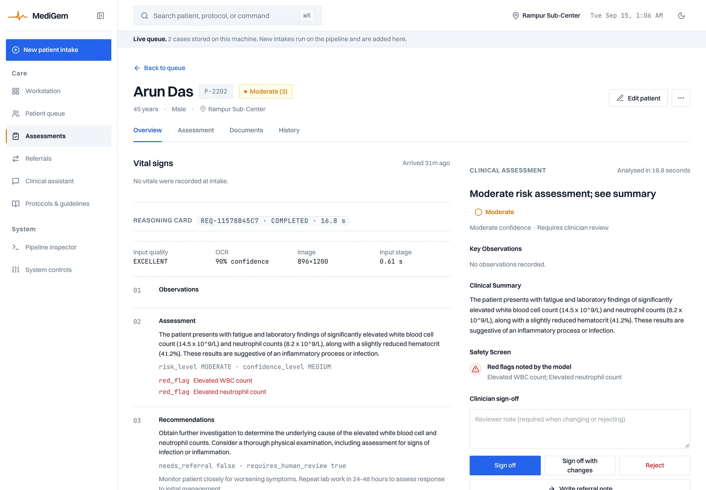

# MediGem

**Clinical decision support that runs entirely on local hardware.** A rural health worker photographs a lab report, an ECG strip, a prescription or a wound; MediGem checks it against deterministic emergency rules first, then runs a local model, validates the output against a schema and a safety guard, stores the case, and hands the clinician a structured assessment to sign off. No uplink is used at any point.

[](https://github.com/reshmanth-sai/MediGem/actions/workflows/frontend.yml)
[](LICENSE)

**Live:** [medigem.vercel.app](https://medigem.vercel.app) · the hosted build runs the product page and an example workstation; intakes replay recorded pipeline runs because Vercel cannot host the model. Everything on screen says which mode it is in.



---

## What it does

| Input | What the pipeline produces |
|---|---|
| Symptoms + vitals typed at intake | An emergency-gate decision in under a millisecond; if it matches, a referral and **no model call** |
| Lab report, ECG, prescription, or wound photo | Image-quality scores, OCR where there is a text layer, and one structured `ClinicalReasoningOutput`: observations · assessment (risk level, qualitative confidence, red flags) · recommendations · patient summary · limitations |
| A finished assessment | A stored case the clinician signs off (approve / modify / reject with a note), corrects, plans, annotates and attaches documents to, with every change in an append-only history; a referral note; a queue that orders by the gate first, then severity |

It does not diagnose, it does not prescribe, and it will not return a dose: a dose or a definitive diagnosis in the model's output fails the safety guard and marks the run degraded.



---

## How it works



Three decisions shape the design:

**Rules before the model.** Acute presentations (cardiac, stroke, sepsis, anaphylaxis, obstetric, snakebite, …) are matched by deterministic rules with a synonym table before any inference. A match ends the request: the model is never consulted for a case where a wrong answer is most expensive. Median 0.35 ms.

**One output contract.** The model must return a Pydantic-validated `ClinicalReasoningOutput`. `requires_human_review` defaults to `true`. A separate `SafetyGuard` runs regex checks for prohibited content (doses, "diagnosed with", certainty claims). Anything that fails is reported as DEGRADED, never passed off as an assessment.

**Nothing on screen is invented.** Every number the site shows is either measured by `evaluation/capture_landing_data.py`, read from the API's `/health`, read from the browser, or derived from the case list. Where a feature does not exist (accounts, encryption, audit log), the settings page says so.

---

## Measured

| Metric | Value | Method |
|---|---|---|
| Emergency gate, matching case | **0.352 ms** median, 0.364 ms p95 | 5,000 evaluations |
| End to end, image → validated assessment | **9.1 s** median, 8.0–13.0 s | 20 runs × 4 modalities |
| Schema-valid outputs | **80 / 80**, all `COMPLETED` | every run validated against `ClinicalReasoningOutput` |
| OCR confidence | 77.5 % | Tesseract mean over the 2 sample documents with a text layer |

Apple M5, `gemma3:4b` via Ollama, 2026-09-14. Raw capture: [`frontend_v2/components/landing/data/capture.json`](frontend_v2/components/landing/data/capture.json), parsed against a Zod schema at build time so the product page cannot drift from the backend's shape.

**What is not measured:** whether the assessments are clinically *right*. These are mechanical figures (latency, validity). A clinical evaluation would need a labelled set reviewed by a clinician; see [Limitations](#limitations).



---

## Run it

Prerequisites: Python 3.10+, Node 20+, [Tesseract](https://tesseract-ocr.github.io/tessdoc/Installation.html), [Ollama](https://ollama.com) with `ollama pull gemma3:4b`.

```bash
git clone https://github.com/reshmanth-sai/MediGem.git && cd MediGem
python -m venv .venv && source .venv/bin/activate && pip install -r requirements.txt

# Terminal 1: the pipeline API (FastAPI over the orchestrator)
uvicorn backend.api.app:app --port 8000        # docs at http://localhost:8000/docs

# Terminal 2: the workstation
cd frontend_v2 && cp .env.example .env.local && npm install && npm run dev
```

Open http://localhost:3000 (product page) and http://localhost:3000/workstation. With the API up the ribbon reads **Live queue**; a new intake runs the pipeline and lands on a stored case. Without the API the workstation shows bundled examples, says so, and an intake replays a recorded run.

<details>
<summary>API</summary>

| Route | Purpose |
|---|---|
| `GET /health` | model, Ollama reachability, gate rule count and latency, case count |
| `GET /rules` | the emergency rules |
| `POST /gate/evaluate` | run the gate on a symptom list |
| `POST /analyze` | multipart: demographics, symptoms, vitals, one image + `image_type`; stores the case, returns the response with `case_id` |
| `GET /cases`, `GET /cases/{id}` | the store |
| `POST /cases/{id}/review` | clinician sign-off: `approved` / `modified` / `rejected` + note |
| `PATCH /cases/{id}/patient` | correct demographics (symptoms, vitals and the assessment stay as recorded) |
| `PUT /cases/{id}/plan` | the clinician's care plan: next step, urgency, follow-up, note |
| `POST /cases/{id}/notes` | append a clinician note |
| `POST /cases/{id}/documents`, `GET …/documents/{doc}` | attach a file to a case and open it later |
| `GET /cases/{id}/events` | the append-only history: every change with actor and time |
| `DELETE /cases/{id}` | remove a case, its notes, documents and files |

Every mutation writes an event; the workstation's History tab reads it. The acting clinician is sent as `X-Actor` until accounts exist.

Optional hardening for a public host: `MEDIGEM_API_KEY` (checked as `X-API-Key` on every POST), `MEDIGEM_ANALYZE_PER_MINUTE` (default 6 per client), `MEDIGEM_CORS_ORIGINS`. Store location: `MEDIGEM_DB_PATH` (default `data/medigem.db`; `:memory:` for tests). Uploaded images are held for one run and deleted.
</details>

<details>
<summary>Tests and checks</summary>

```bash
# backend: 65 tests (pipeline, gate, safety guard, API, case store)
MEDIGEM_DB_PATH=:memory: python -m unittest discover -s tests -p "test_*.py"

# frontend: 170 unit tests, type-check, lint, design gate, build
cd frontend_v2 && npm test && npm run type-check && npm run lint && npm run gate && npm run build:verify

# end to end: 19 Playwright checks on desktop and phone against a production build in replay mode,
# including axe WCAG 2 A/AA on five routes (the first run caught four contrast failures and a
# disclosure control that had no button role)
npm run e2e

# with the API and dev server running: one flow that edits a patient, sets a plan, adds a note,
# attaches a file, checks the history, signs off, exports and deletes a stored case
MEDIGEM_LIVE=1 npm run e2e:live
```

The design gate (`scripts/slop-gate.mjs`) fails the build on hex colours outside the token files, sub-13 px type, shadows, emoji, numeric AI confidence, and a few other things that made the earlier UI look generated. CI runs all of it on every push.
</details>

---

## Repository

```
backend/
  api/          FastAPI layer: /health /rules /gate /analyze /cases
  emergency/    deterministic rule gate (rules.json + synonyms)
  input/        image quality, OCR, PDF text extraction
  reasoning/    prompt composition, output schema, validator, safety guard
  pipeline/     orchestration strategies per modality
  store/        SQLite case store
  services/     orchestrator (validate → gate → route → pipeline)
frontend_v2/
  app/          Next.js routes: product page at /, workstation under /workstation …
  components/   landing (GSAP, canvas ECG, WebGL document plane) · cases · layout · results
  lib/          api client, schemas (Zod mirrors of the Python models), mappers, replay
  providers/    CasesProvider (live store or bundled examples), theme, accessibility
evaluation/     capture_landing_data.py — the script every published figure comes from
tests/          backend suite
docs/           architecture, safety, limitations
```

---

## Decisions worth explaining

- **Why a rule gate and not "just prompt it to be careful".** The failure mode of an LLM on an acute case is a plausible, wrong answer. Rules are inspectable and testable (matching, synonyms, priority resolution, benign input, latency are all under test) and the product page shows the real match latency.
- **Why the workstation refuses to fake a result.** An earlier version computed a risk score in the browser with a heuristic and animated "AI stages" with timers. It once produced `EMERGENCY` with the action "routine ECG within 48 hours". It was removed; without the API, the intake replays a *recorded* run and labels it as such.
- **Why SQLite, no ORM.** One process, one clinic, one file. `sqlite3` from the standard library, a single table, and a `:memory:` mode that makes the test suite hermetic.
- **Why the safety guard needed fixing.** Its dosage regex read the haemoglobin value `13.8 g/dL` as the dose "8 g" and marked every lab-report run DEGRADED. Found by re-running the capture at 20 runs per modality; fixed with a negative lookahead for concentrations and a test file of lab values that must pass and doses that must not.
- **Why the fonts are bundled.** The first build loaded Switzer from Fontshare on every route — an offline product whose UI needed an uplink. `next/font/local` now.

---

## Limitations

- **Not clinically validated.** No labelled dataset, no clinician agreement study, no outcome data. The measured figures are latency and schema validity only. This is decision *support* for a clinician who decides; it is not a diagnostic device and is not certified as one.
- **No accounts.** The signed-in clinician is a fixed demo persona; sign-offs are recorded under that name.
- **One machine.** Single-process API, plain SQLite file, no backup or encryption at rest, no installer. "Offline" means a laptop serving itself over the clinic's own network.
- **Small model, small gate.** `gemma3:4b` with no clinical fine-tuning; 11 rules with English synonyms. Observations occasionally come back empty; OCR is Tesseract with no preprocessing.
- **Hardware.** 9 s is an Apple M5 figure. Expect 60–120 s per assessment on a CPU-only laptop.

What I would do next, in order: local accounts and an append-only event log; a labelled evaluation set with a clinician; a single-process install (standalone Next build served by the API, `docker compose`); Hindi patient summaries. See [`docs/ROADMAP.md`](docs/ROADMAP.md).

---

## Docs

[Architecture](docs/ARCHITECTURE.md) · [Safety design](docs/SAFETY.md) · [Limitations](docs/LIMITATIONS.md) · [Roadmap](docs/ROADMAP.md) · [Evaluation](docs/EVALUATION.md)

Apache 2.0. Built with Gemma 3.
